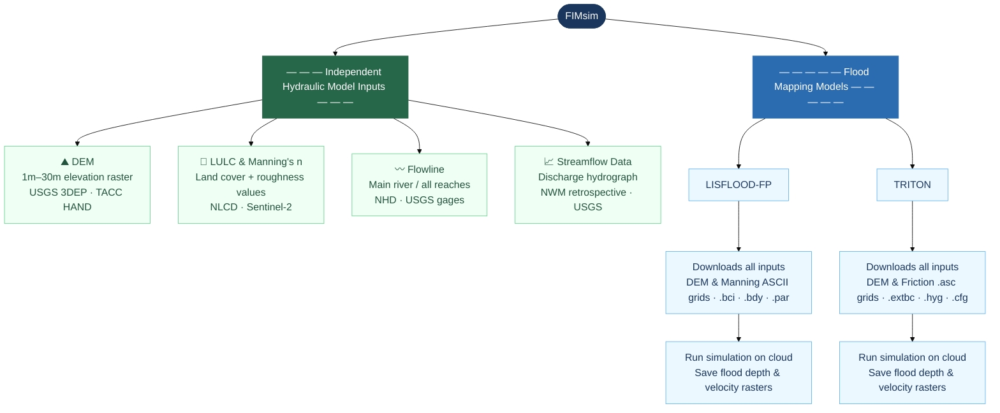

# FIMsim — Flood Inundation Model Simulation Tool

> **v1.0** · Web Application · Desktop installers available for macOS and Windows

FIMsim is a web-based tool designed to eliminate the technical barrier of setting up 2D flood simulations. It serves two distinct purposes: **(1) automated preparation of individual hydraulic model input data** — including terrain, land cover, river networks, and streamflow time series — and **(2) end-to-end configuration and cloud execution of complete flood mapping simulations** for two supported hydraulic models (LISFLOOD-FP and TRITON). Users define a study area, and FIMsim handles all data downloading, processing, and file formatting automatically. For users who prefer a local setup, standalone desktop installers for macOS and Windows are also available — no Python installation or technical configuration required.

---

## What the app does

FIMsim addresses two separate but related challenges in flood modeling:

**1. Preparing individual model inputs independently**
Hydrologists often need specific geospatial datasets — a DEM for one project, LULC for another, streamflow records for analysis — without running a full simulation. FIMsim provides four standalone tools that each produce one type of input file, ready to use in any model or workflow.

**2. Running a complete flood simulation end to end**
When the goal is a full flood inundation map, FIMsim can take over the entire pipeline. After the user defines a study area, it downloads every required input, writes all model-specific configuration files, and submits the simulation to run on cloud infrastructure — no local software installation or GIS expertise required.

| Track | What it does |
|---|---|
| **Independent Hydraulic Model Inputs** | Four standalone tools — each prepares one input type (DEM, LULC & Manning's n, Flowlines, Streamflow Data) independently of any model |
| **Flood Mapping Models** | Two complete simulation pipelines — each downloads all required inputs, writes all model files, and runs the simulation on cloud infrastructure |

---

## Workflow overview



---

## Data sources

FIMsim connects to the following public data services. An internet connection is required during data downloads.

| Dataset | Provider | Coverage |
|---|---|---|
| Digital Elevation Model (DEM) | USGS 3DEP (1 m, 10 m, 30 m) | USA |
| Height Above Nearest Drainage (HAND) | TACC | USA |
| Land Use / Land Cover (LULC) | NLCD — USGS | USA |
| Land Use / Land Cover (LULC) | Sentinel-2 — Esri | Global |
| River flowlines | NHD — USGS | USA |
| USGS stream gages | USGS Water Services | USA |
| Streamflow time series | NWM Retrospective v2.1 — NOAA | USA · 1979–2020 |
| Streamflow forecast | NWM Operational — NOAA | USA · ~10-day horizon |

---

## Supported flood models

| Model | Type | Input files generated |
|---|---|---|
| **LISFLOOD-FP** | 2D raster-based | `.par` · `.bci` · `.bdy` · DEM and Manning ASCII grids |
| **TRITON** | 2D GPU-accelerated | `.cfg` · `.extbc` · `.hyg` · DEM and friction ASCII grids |

---

## Key features

- **Multi-AOI batch processing** — define multiple study areas in a single shapefile or GeoPackage; all downloads and outputs are handled per AOI automatically
- **Background downloads** — all data downloads run in background threads so the interface stays responsive
- **Persistent project context** — each project saves its state to `workflow_context.json` so work can be resumed at any step
- **Editable Manning's n table** — the LULC step generates a land-cover lookup table with Min / Avg / Max roughness values that the user can edit before export
- **Upstream / downstream detection** — the flowline step automatically identifies the upstream and downstream endpoints of the main river and marks them on the map
- **Hydrograph preview** — the streamflow step plots discharge time series for visual inspection before saving

---

## Getting started

### Web application
FIMsim is deployed as a web application — no installation required. Open it in any browser and start a project immediately.

> 🔗 **Live app:** *(link coming soon)*

### Desktop installers
For users who prefer a local installation, standalone installers are available on the [Releases](../../releases) page — no Python or conda setup required.

| Platform | File |
|---|---|
| macOS | `FIMsim-mac.dmg` — drag to Applications |
| Windows | `FIMsim-setup-windows.exe` — run installer wizard |

### Run from source (contributors)
```bash
git clone https://github.com/pnikrou/FIMsim.git
cd FIMsim
conda create -n fimsim python=3.11 -y
conda activate fimsim
conda install -c conda-forge geopandas pyogrio rasterio pyproj shapely scipy numpy pandas openpyxl h5py requests -y
pip install PyQt6 matplotlib xarray zarr s3fs fsspec numcodecs pynhd pygeoogc gmsh certifi
python main.py
```

---

## Project structure

```
FIMsim/
├── main.py               ← entry point
├── requirements.txt      ← all Python dependencies
├── gui/                  ← all interface widgets and pages
├── core/                 ← all data-download and file-writing logic
├── data/                 ← bundled GeoJSON files (US states, HUC6, HUC8)
├── build_app.spec        ← PyInstaller spec for building installers
└── .github/workflows/    ← CI — auto-builds Mac + Windows installers on tag push
```

---

## Mode documentation

> Detailed documentation for each mode will be added below.

<!-- INPUT PARAMETERS -->
<!-- DEM mode -->
<!-- LULC & Manning mode -->
<!-- Flowline mode -->
<!-- Streamflow Data mode -->

<!-- FLOOD MAPPING MODELS -->
<!-- LISFLOOD-FP mode -->
<!-- TRITON mode -->

