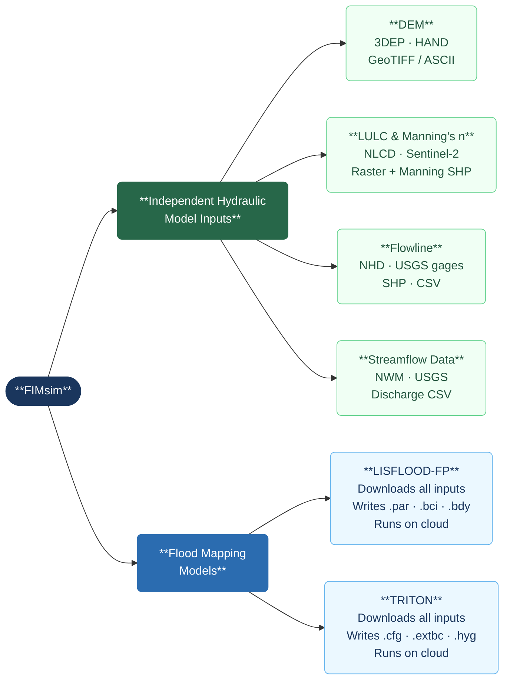

# FIMsim — Flood Inundation Model Simulation Tool

> **v1.0** · Python 3.11 · PyQt6 · macOS / Windows / Linux

FIMsim is a desktop application that automates the full geospatial pre-processing pipeline required to set up and run 2D flood simulation models. Instead of manually downloading elevation data, land cover rasters, river networks, and discharge time series from scattered sources — then reformatting each file for a specific model — FIMsim handles everything through a guided graphical interface. The user defines a study area, selects data sources, and the tool prepares all model-ready input files automatically.

---

## What the app does

Setting up a flood model from scratch typically requires expertise across multiple GIS tools, hydrology databases, and model-specific file formats. FIMsim removes that barrier by connecting directly to authoritative data sources (USGS, NOAA, NHD, Esri) and writing the exact file formats each supported model expects.

The application is organized into two independent tracks:

| Track | Purpose |
|---|---|
| **Input Parameters** | Prepare individual geospatial datasets as standalone outputs — each tool produces one input type, independent of any model |
| **Flood Mapping Models** | Select a model and FIMsim handles everything — it downloads all required inputs, prepares all model files, and can submit the simulation to run on cloud infrastructure |

---

## Workflow overview



---

## Data sources

FIMsim connects to the following public data services. An internet connection is required during data downloads.

| Dataset | Provider | Coverage |
|---|---|---|
| Digital Elevation Model (DEM) | USGS 3DEP (1 m, 10 m, 30 m) | USA |
| Height Above Nearest Drainage (HAND) | TACC | USA |
| Land Use / Land Cover (LULC) | NLCD — USGS | USA |
| Land Use / Land Cover (LULC) | Sentinel-2 — Esri | Global |
| River flowlines | NHD — USGS | USA |
| USGS stream gages | USGS Water Services | USA |
| Streamflow time series | NWM Retrospective v2.1 — NOAA | USA · 1979–2020 |
| Streamflow forecast | NWM Operational — NOAA | USA · ~10-day horizon |

---

## Supported flood models

| Model | Type | Input files generated |
|---|---|---|
| **LISFLOOD-FP** | 2D raster-based | `.par` · `.bci` · `.bdy` · DEM and Manning ASCII grids |
| **TRITON** | 2D GPU-accelerated | `.cfg` · `.extbc` · `.hyg` · DEM and friction ASCII grids |

---

## Key features

- **Multi-AOI batch processing** — define multiple study areas in a single shapefile or GeoPackage; all downloads and outputs are handled per AOI automatically
- **Background downloads** — all data downloads run in background threads so the interface stays responsive
- **Persistent project context** — each project saves its state to `workflow_context.json` so work can be resumed at any step
- **Editable Manning's n table** — the LULC step generates a land-cover lookup table with Min / Avg / Max roughness values that the user can edit before export
- **Upstream / downstream detection** — the flowline step automatically identifies the upstream and downstream endpoints of the main river and marks them on the map
- **Hydrograph preview** — the streamflow step plots discharge time series for visual inspection before saving

---

## Getting started

```bash
# 1 — Clone the repository
git clone https://github.com/parvanehnikrou/FIMsim.git
cd FIMsim

# 2 — Create and activate a Python 3.11 environment
conda create -n fimsim python=3.11 -y
conda activate fimsim

# 3 — Install geospatial dependencies (GDAL, PROJ, GEOS)
conda install -c conda-forge geopandas pyogrio rasterio pyproj shapely scipy numpy pandas openpyxl h5py requests -y

# 4 — Install remaining packages
pip install PyQt6 matplotlib xarray zarr s3fs fsspec numcodecs pynhd pygeoogc gmsh certifi

# 5 — Launch the app
python main.py
```

> **No Python needed for end users** — pre-built installers for Mac (`.dmg`) and Windows (`.exe`) are available on the [Releases](../../releases) page.

---

## Project structure

```
FIMsim/
├── main.py               ← entry point
├── requirements.txt      ← all Python dependencies
├── gui/                  ← all interface widgets and pages
├── core/                 ← all data-download and file-writing logic
├── data/                 ← bundled GeoJSON files (US states, HUC6, HUC8)
├── build_app.spec        ← PyInstaller spec for building installers
└── .github/workflows/    ← CI — auto-builds Mac + Windows installers on tag push
```

---

## Mode documentation

> Detailed documentation for each mode will be added below.

<!-- INPUT PARAMETERS -->
<!-- DEM mode -->
<!-- LULC & Manning mode -->
<!-- Flowline mode -->
<!-- Streamflow Data mode -->

<!-- FLOOD MAPPING MODELS -->
<!-- LISFLOOD-FP mode -->
<!-- TRITON mode -->

